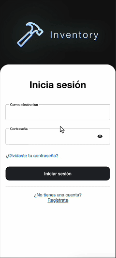
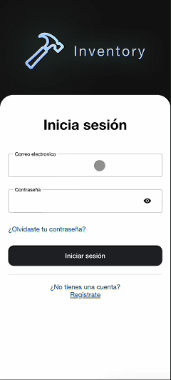
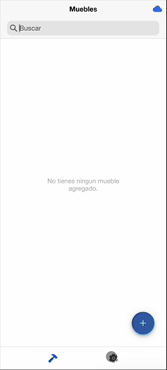
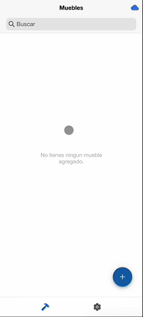
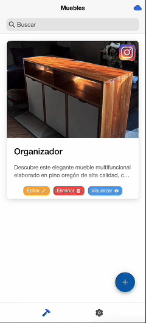
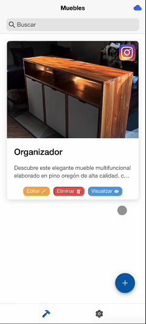

# 📦 Inventory  

**Inventory** es la primera aplicación móvil que he desarrollado con un propósito real, aplicando todo el conocimiento adquirido en mi carrera. Surge como solución a una necesidad específica de un cliente: mi padre, quien es mueblista y ha llevado el registro de sus trabajos en un cuaderno físico.  

Cada vez que necesitaba recrear un mueble previamente hecho, debía revisar manualmente entre numerosas hojas hasta encontrar el diseño adecuado. **Inventory** resuelve este problema al digitalizar y organizar su catálogo de muebles de manera intuitiva y accesible.  

## 🚀 Características  

- 📋 **Gestión de muebles**: Agrega muebles con información detallada, incluyendo:  
  - Nombre  
  - Descripción  
  - Enlace de Instagram (si existe una publicación)  
  - Fotografías  
  - Costos  
  - Cortes y materiales  
- 🔎 **Búsqueda y filtrado**: Encuentra muebles fácilmente mediante un sistema de filtrado por nombre y descripción.  
- ✏️ **Edición y eliminación**: Modifica o elimina muebles registrados según sea necesario.  
- ⚙️ **Manejo de los datos**: Controla tus datos de manera clara y efectiva, pudiendo eliminar o modificar información personal. 

## 🛠️ Tecnologías utilizadas  

- **Ionic + Angular** para el desarrollo de la esta aplicación ya que se han utilizado componentes hechos por ellos, iconos, etc.
- **TypeScript** para mejorar la logica.
- **SCSS** para el diseño y estilización.
- **Firebase** para el almacenado de información como los muebles agregados.
- **Cloudinary** para el almacenado de imagenes que se encuentran dentro de los muebles agregados.

## 📱 Capturas de pantalla y gifs

<div align="center">

### 🔹 Autenticación  

  
  
  

### 🔹 Uso de la aplicación  

  
 
  
  
  
  

</div>

## 📌 Instalación y uso

Tener en cuenta que esta aplicación esta diseñada para ser utilizada en Android y no para IOS.

Antes de instalar el .APK debes permitirle a tu dispositivo poder instalar cualquier aplicación extraña, si no lo permites no podrás instalar la aplicación.

ㅤ1. Descargar el .APK dentro de la carpeta llamada:  
   ```bash
   APK FILE (Production app)/inventory-prod.apk
   ```

ㅤ2. Abrir dentro de tu dispositivo y instalar.  

## 🧑🏻‍💻 Para desarrolladores

Si quieres modificar o ver el codigo fuente de la aplicación deberas seguir estos pasos.

ㅤ1. Clona este repositorio:
   ```bash
   git clone https://github.com/matiasfel/Inventory-baxman.git
   cd inventory-baxman
   ```
ㅤ2. Instala todas las dependencias:
   ```bash
   npm install
   ```

ㅤ3. Ejecuta la aplicación en un dispositivo o emulador:  
   ```bash
   ionic serve
   ```

Ten en cuenta que deberás agregar tus propios archivos de environment.ts / environment.prod.ts con todo lo requerido, que sería detallar lo que pide firebase, por ende deberás crearte una aplicación en Firebase y configurar Cloudinary para que funcione de manera correcta.

## 🎯 Objetivo del proyecto  

Facilitar el proceso de registro y consulta de muebles construidos, optimizando el tiempo y mejorando la organización del taller de mi padre.
